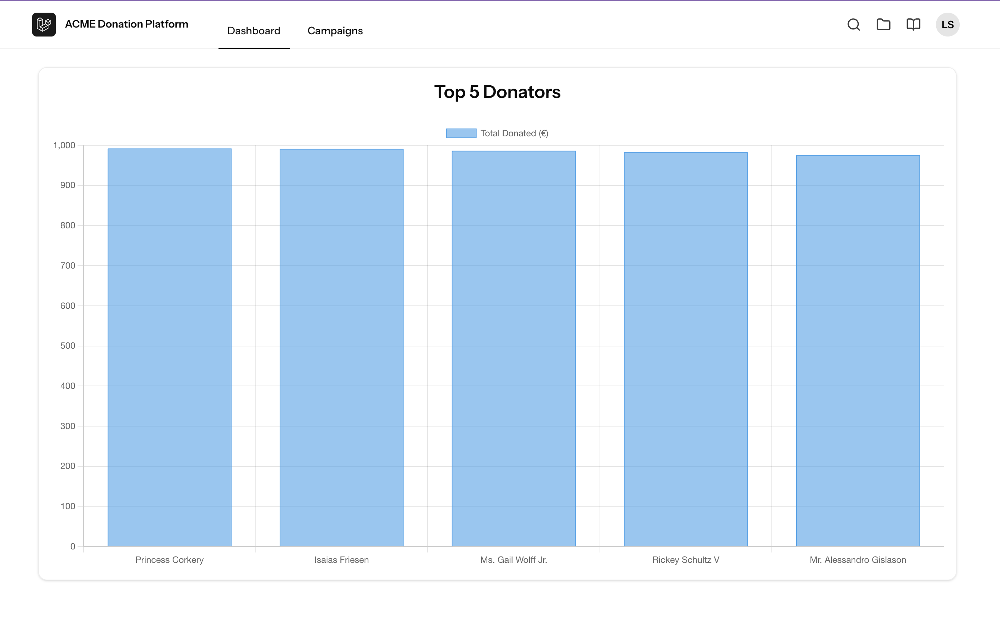
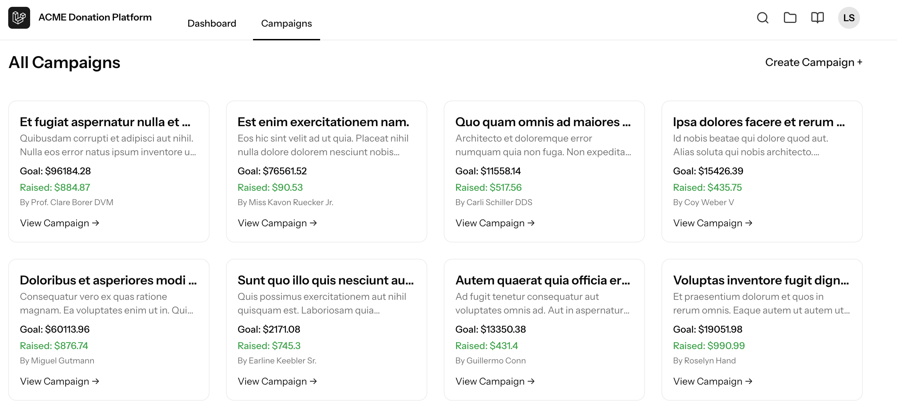
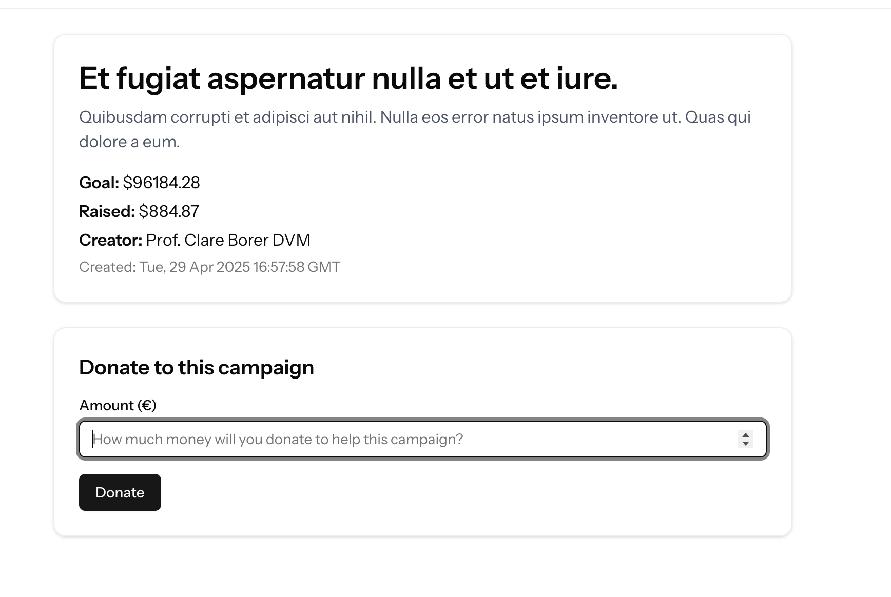

## 📚 Overview

This platform allows authenticated ACME employees to:
- ✅ Create and manage fundraising campaigns
- ✅ Donate to causes created by fellow employees
- ✅ View real-time progress and analytics via a dashboard

The backend provides a clean, well-documented RESTful API while also serving modern Vue-based SPA views via Inertia.

---

## ⚙️ Tech Stack

| Layer         | Technology             | Why Chosen                                                        |
| ------------- | ---------------------- | ----------------------------------------------------------------- |
| Backend       | Laravel 12             | Clean, testable, scalable backend with built-in auth & validation |
| Frontend      | Vue 3 + Inertia.js     | SPA experience with full server-side routing and SSR support      |
| Styling       | Tailwind CSS           | Modern utility-based styling and icon set                         |
| State & Logic | Composition API        | Clean reactivity and composability                                |
| API Auth      | Laravel Sanctum        | Secure SPA auth using cookies                                     |
| Testing       | PestPHP + PHPStan      | Fast, expressive tests + static analysis                          |
| DB            | SQLite                 | Lightweight local DB (can switch to MySQL/Postgres easily)        |
| Charts        | Chart.js + vue-chartjs | Lightweight, responsive data visualizations                       |
| Payments      | DummyPaymentGateway    | Mocked for now; easy to swap via interface binding                |
| Containers    | Laravel Sail + Docker  | Simple local Dockerized environment                               |

---

## 🧠 Architecture Decisions

### 🔁 Unified Controller API + View Responses
- Controllers like `CampaignController` respond with either JSON or Inertia views based on `request()->wantsJson()`.
- Eliminates duplicate logic across API and web interfaces.
  
### 🧩 Contracts & Bindings
- Payment logic is abstracted via `PaymentGatewayInterface` to allow last-minute gateway choice (e.g., Stripe, PayPal).
- Easily mockable for tests.

### 📁 Project Structure
<pre>
<code>
app
  ┣ Contracts
  ┣ Http\Controllers\Api\V1
  ┣ Http\Requests
  ┣ Models
  ┣ Notifications
  ┣ Resources\V1
  ┣ Traits (e.g. ApiFailsGracefully)
resources/js
  ┣ Pages
  ┣ Components
  ┣ api (axios functions)
  ┣ types (shared TS interfaces)
database
  ┣ factories
  ┣ migrations
docker
  ┣ dockerfile / scripts
</code>
</pre>

---

## 📦 API Routes

| Method   | URI                                | Description        |
| -------- | ---------------------------------- | ------------------ |
| `GET`    | `/api/v1/campaigns`                | List campaigns     |
| `POST`   | `/api/v1/campaigns`                | Create campaign    |
| `GET`    | `/api/v1/campaigns/{id}`           | View campaign      |
| `PUT`    | `/api/v1/campaigns/{id}`           | Update campaign    |
| `DELETE` | `/api/v1/campaigns/{id}`           | Delete campaign    |
| `POST`   | `/api/v1/campaigns/{id}/donations` | Donate to campaign |

---

## 📊 UI Features

### Dashboard
- Top 5 Donators (Bar Chart)

|  |
| :-----------------------------------------------: |
|                  Dashboard View                   |

### Campaigns
- Create and view campaigns
- List of all active campaigns
- Campaign detail includes donation form and progress

|  |
| :----------------------------------------: |
|           Campaign Listing View            |

|  |
| :----------------------------------------------: |
|              Campaign Details View               |

---

## 🧪 Testing & Quality

- ✅ PHPStan level 8 static analysis
- ✅ Pest-powered feature tests (`tests/Feature`)
- ✅ Dummy gateway tested via unit test
- ✅ Run: `./vendor/bin/pest`
- ✅ TypeScript strict mode enabled
- ✅ Prettier, ESLint, and Tailwind format plugins

---
